# On-Device AI Framework - Architecture & Technical Diagrams

This document provides comprehensive architectural diagrams and technical specifications for the On-Device AI Framework using Qdrant Embedded Vector Search.

---

## Table of Contents

1. [System Architecture](#1-system-architecture)
2. [Component Interaction](#2-component-interaction)
3. [Data Flow Diagrams](#3-data-flow-diagrams)
4. [Use Case Diagrams](#4-use-case-diagrams)
5. [Sequence Diagrams](#5-sequence-diagrams)
6. [Deployment Architecture](#6-deployment-architecture)
7. [Database Schema](#7-database-schema)
8. [Technology Stack](#8-technology-stack)

---

## 1. System Architecture

### 1.1 High-Level Architecture

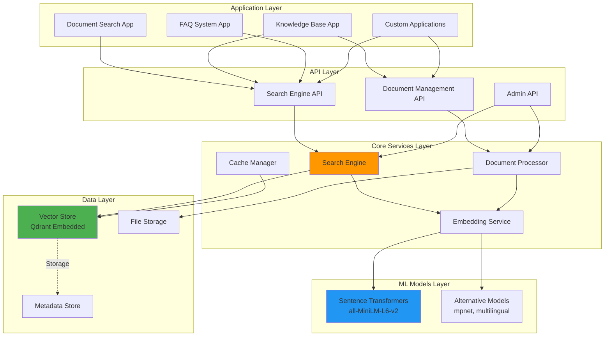
```mermaid
graph TB
    subgraph "Application Layer"
        A1[Document Search App]
        A2[Knowledge Base App]
        A3[FAQ System App]
        A4[Custom Applications]
    end
    
    subgraph "API Layer"
        B1[Search Engine API]
        B2[Document Management API]
        B3[Admin API]
    end
    
    subgraph "Core Services Layer"
        C1[Search Engine]
        C2[Document Processor]
        C3[Embedding Service]
        C4[Cache Manager]
    end
    
    subgraph "Data Layer"
        D1[Vector Store<br/>Qdrant Embedded]
        D2[Metadata Store]
        D3[File Storage]
    end
    
    subgraph "ML Models Layer"
        E1[Sentence Transformers<br/>all-MiniLM-L6-v2]
        E2[Alternative Models<br/>mpnet, multilingual]
    end
    
    A1 --> B1
    A2 --> B1
    A2 --> B2
    A3 --> B1
    A4 --> B1
    A4 --> B2
    
    B1 --> C1
    B2 --> C2
    B3 --> C1
    B3 --> C2
    
    C1 --> C3
    C1 --> D1
    C2 --> C3
    C2 --> D3
    C3 --> E1
    C3 --> E2
    C4 --> D1
    
    D1 -.Storage.-> D2
    
    style D1 fill:#4CAF50
    style E1 fill:#2196F3
    style C1 fill:#FF9800
```

### 1.2 Layered Architecture

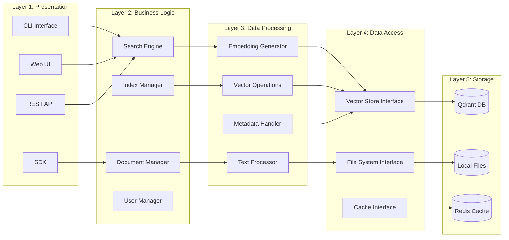
```mermaid
graph LR
    subgraph "Layer 1: Presentation"
        L1A[CLI Interface]
        L1B[Web UI]
        L1C[REST API]
        L1D[SDK]
    end
    
    subgraph "Layer 2: Business Logic"
        L2A[Search Engine]
        L2B[Document Manager]
        L2C[Index Manager]
        L2D[User Manager]
    end
    
    subgraph "Layer 3: Data Processing"
        L3A[Embedding Generator]
        L3B[Text Processor]
        L3C[Vector Operations]
        L3D[Metadata Handler]
    end
    
    subgraph "Layer 4: Data Access"
        L4A[Vector Store Interface]
        L4B[File System Interface]
        L4C[Cache Interface]
    end
    
    subgraph "Layer 5: Storage"
        L5A[(Qdrant DB)]
        L5B[(Local Files)]
        L5C[(Redis Cache)]
    end
    
    L1A --> L2A
    L1B --> L2A
    L1C --> L2A
    L1D --> L2B
    
    L2A --> L3A
    L2B --> L3B
    L2C --> L3C
    
    L3A --> L4A
    L3B --> L4B
    L3C --> L4A
    L3D --> L4A
    
    L4A --> L5A
    L4B --> L5B
    L4C --> L5C
```

---

## 2. Component Interaction

### 2.1 Core Components Diagram

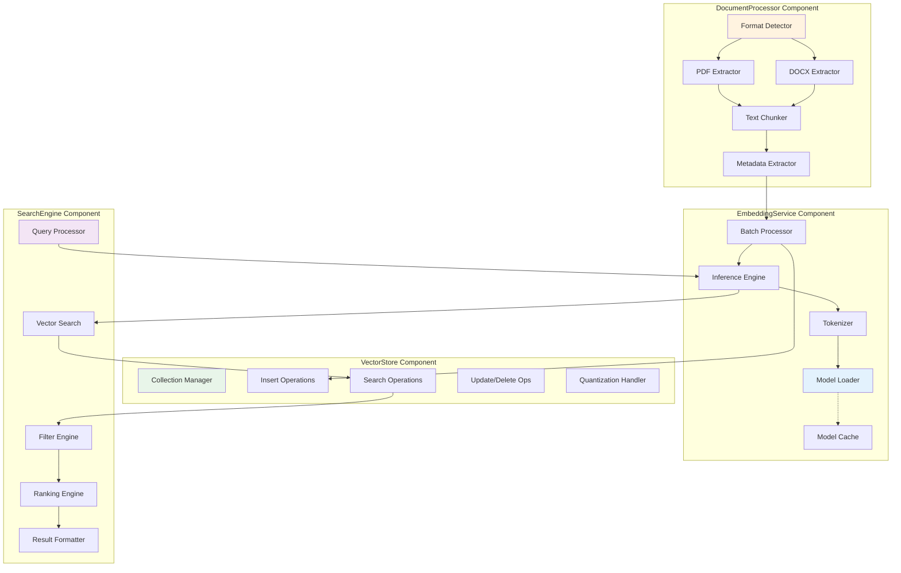
```mermaid
graph TB
    subgraph "VectorStore Component"
        VS1[Collection Manager]
        VS2[Insert Operations]
        VS3[Search Operations]
        VS4[Update/Delete Ops]
        VS5[Quantization Handler]
    end
    
    subgraph "EmbeddingService Component"
        ES1[Model Loader]
        ES2[Tokenizer]
        ES3[Inference Engine]
        ES4[Batch Processor]
        ES5[Model Cache]
    end
    
    subgraph "DocumentProcessor Component"
        DP1[Format Detector]
        DP2[PDF Extractor]
        DP3[DOCX Extractor]
        DP4[Text Chunker]
        DP5[Metadata Extractor]
    end
    
    subgraph "SearchEngine Component"
        SE1[Query Processor]
        SE2[Vector Search]
        SE3[Filter Engine]
        SE4[Ranking Engine]
        SE5[Result Formatter]
    end
    
    DP1 --> DP2
    DP1 --> DP3
    DP2 --> DP4
    DP3 --> DP4
    DP4 --> DP5
    
    DP5 --> ES4
    ES4 --> ES3
    ES3 --> ES2
    ES2 --> ES1
    ES1 -.-> ES5
    
    ES4 --> VS2
    SE1 --> ES3
    ES3 --> SE2
    SE2 --> VS3
    VS3 --> SE3
    SE3 --> SE4
    SE4 --> SE5
    
    style VS1 fill:#E8F5E9
    style ES1 fill:#E3F2FD
    style DP1 fill:#FFF3E0
    style SE1 fill:#F3E5F5
```

### 2.2 Component Communication Flow

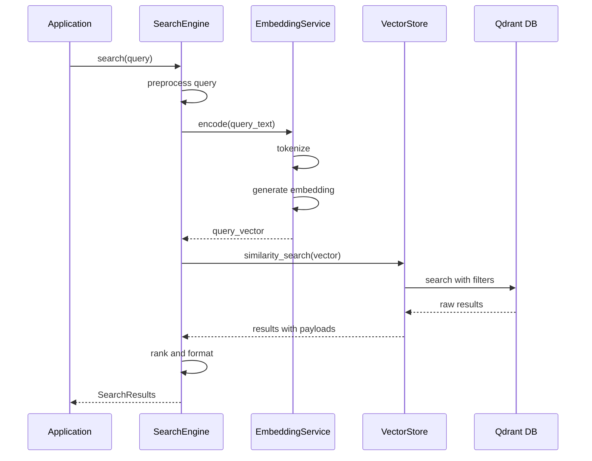
```mermaid
sequenceDiagram
    participant App as Application
    participant SE as SearchEngine
    participant ES as EmbeddingService
    participant VS as VectorStore
    participant QD as Qdrant DB
    
    App->>SE: search(query)
    SE->>SE: preprocess query
    SE->>ES: encode(query_text)
    ES->>ES: tokenize
    ES->>ES: generate embedding
    ES-->>SE: query_vector
    SE->>VS: similarity_search(vector)
    VS->>QD: search with filters
    QD-->>VS: raw results
    VS-->>SE: results with payloads
    SE->>SE: rank and format
    SE-->>App: SearchResults
```

### 2.3 Data Processing Pipeline

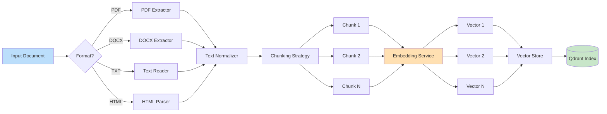
```mermaid
flowchart LR
    A[Input Document] --> B{Format?}
    B -->|PDF| C[PDF Extractor]
    B -->|DOCX| D[DOCX Extractor]
    B -->|TXT| E[Text Reader]
    B -->|HTML| F[HTML Parser]
    
    C --> G[Text Normalizer]
    D --> G
    E --> G
    F --> G
    
    G --> H[Chunking Strategy]
    H --> I[Chunk 1]
    H --> J[Chunk 2]
    H --> K[Chunk N]
    
    I --> L[Embedding Service]
    J --> L
    K --> L
    
    L --> M[Vector 1]
    L --> N[Vector 2]
    L --> O[Vector N]
    
    M --> P[Vector Store]
    N --> P
    O --> P
    
    P --> Q[(Qdrant Index)]
    
    style A fill:#BBDEFB
    style Q fill:#C8E6C9
    style L fill:#FFE0B2
```

---

## 3. Data Flow Diagrams

### 3.1 Document Indexing Flow

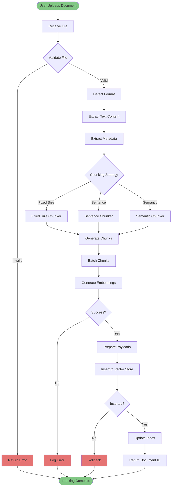
```mermaid
flowchart TD
    Start([User Uploads Document]) --> A[Receive File]
    A --> B{Validate File}
    B -->|Invalid| Error1[Return Error]
    B -->|Valid| C[Detect Format]
    
    C --> D[Extract Text Content]
    D --> E[Extract Metadata]
    E --> F{Chunking Strategy}
    
    F -->|Fixed Size| G1[Fixed Size Chunker]
    F -->|Sentence| G2[Sentence Chunker]
    F -->|Semantic| G3[Semantic Chunker]
    
    G1 --> H[Generate Chunks]
    G2 --> H
    G3 --> H
    
    H --> I[Batch Chunks]
    I --> J[Generate Embeddings]
    J --> K{Success?}
    
    K -->|No| Error2[Log Error]
    K -->|Yes| L[Prepare Payloads]
    
    L --> M[Insert to Vector Store]
    M --> N{Inserted?}
    
    N -->|No| Error3[Rollback]
    N -->|Yes| O[Update Index]
    
    O --> P[Return Document ID]
    P --> End([Indexing Complete])
    
    Error1 --> End
    Error2 --> End
    Error3 --> End
    
    style Start fill:#81C784
    style End fill:#81C784
    style Error1 fill:#E57373
    style Error2 fill:#E57373
    style Error3 fill:#E57373
```

### 3.2 Search Query Flow

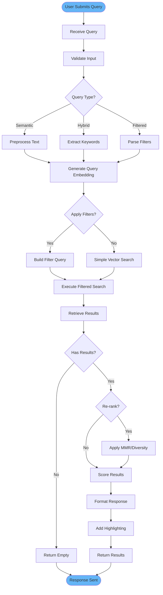
```mermaid
flowchart TD
    Start([User Submits Query]) --> A[Receive Query]
    A --> B[Validate Input]
    B --> C{Query Type?}
    
    C -->|Semantic| D1[Preprocess Text]
    C -->|Hybrid| D2[Extract Keywords]
    C -->|Filtered| D3[Parse Filters]
    
    D1 --> E[Generate Query Embedding]
    D2 --> E
    D3 --> E
    
    E --> F{Apply Filters?}
    F -->|Yes| G1[Build Filter Query]
    F -->|No| G2[Simple Vector Search]
    
    G1 --> H[Execute Filtered Search]
    G2 --> H
    
    H --> I[Retrieve Results]
    I --> J{Has Results?}
    
    J -->|No| K[Return Empty]
    J -->|Yes| L{Re-rank?}
    
    L -->|Yes| M[Apply MMR/Diversity]
    L -->|No| N[Score Results]
    
    M --> N
    N --> O[Format Response]
    O --> P[Add Highlighting]
    P --> Q[Return Results]
    
    K --> End([Response Sent])
    Q --> End
    
    style Start fill:#64B5F6
    style End fill:#64B5F6
```

### 3.3 Update Operation Flow

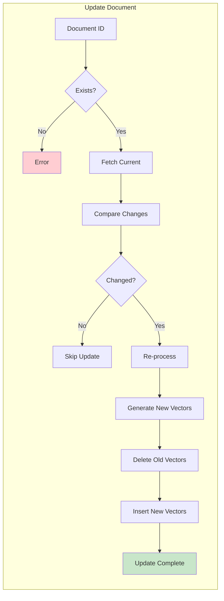
```mermaid
flowchart LR
    subgraph "Update Document"
        A[Document ID] --> B{Exists?}
        B -->|No| C[Error]
        B -->|Yes| D[Fetch Current]
        D --> E[Compare Changes]
        E --> F{Changed?}
        F -->|No| G[Skip Update]
        F -->|Yes| H[Re-process]
        H --> I[Generate New Vectors]
        I --> J[Delete Old Vectors]
        J --> K[Insert New Vectors]
        K --> L[Update Complete]
    end
    
    style C fill:#FFCDD2
    style L fill:#C8E6C9
```

---

## 4. Use Case Diagrams

### 4.1 Primary Use Cases

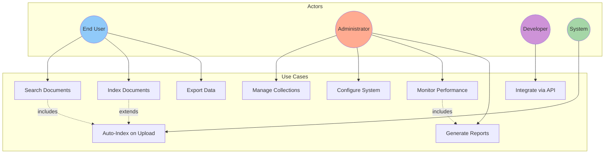
```mermaid
graph TB
    subgraph "Actors"
        U1((End User))
        U2((Administrator))
        U3((Developer))
        U4((System))
    end
    
    subgraph "Use Cases"
        UC1[Search Documents]
        UC2[Index Documents]
        UC3[Manage Collections]
        UC4[Configure System]
        UC5[Monitor Performance]
        UC6[Export Data]
        UC7[Integrate via API]
        UC8[Auto-Index on Upload]
        UC9[Generate Reports]
    end
    
    U1 --> UC1
    U1 --> UC2
    U1 --> UC6
    
    U2 --> UC3
    U2 --> UC4
    U2 --> UC5
    U2 --> UC9
    
    U3 --> UC7
    
    U4 --> UC8
    
    UC1 -.includes.-> UC8
    UC2 -.extends.-> UC8
    UC5 -.includes.-> UC9
    
    style U1 fill:#90CAF9
    style U2 fill:#FFAB91
    style U3 fill:#CE93D8
    style U4 fill:#A5D6A7
```

### 4.2 Document Search Use Case Detail

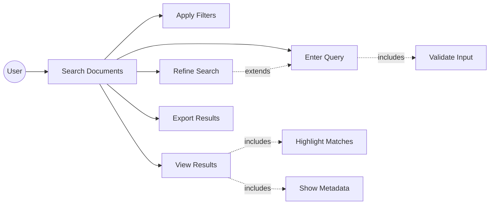
```mermaid
graph LR
    U((User)) --> UC1[Search Documents]
    
    UC1 --> UC1A[Enter Query]
    UC1 --> UC1B[Apply Filters]
    UC1 --> UC1C[View Results]
    UC1 --> UC1D[Refine Search]
    UC1 --> UC1E[Export Results]
    
    UC1A -.includes.-> UC1F[Validate Input]
    UC1C -.includes.-> UC1G[Highlight Matches]
    UC1C -.includes.-> UC1H[Show Metadata]
    UC1D -.extends.-> UC1A
```

### 4.3 Document Indexing Use Case Detail

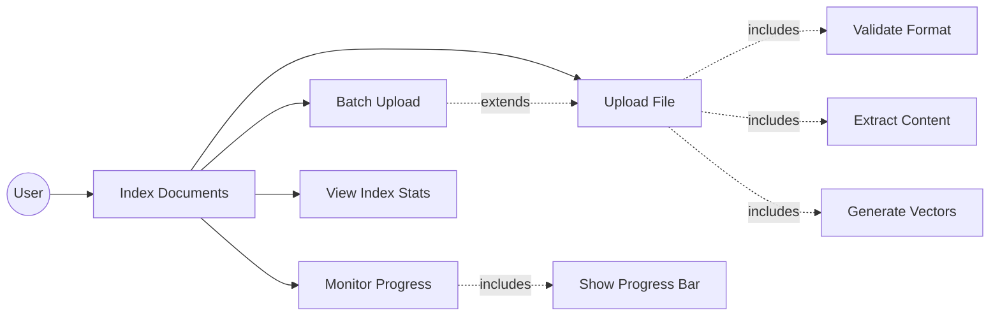
```mermaid
graph LR
    U((User)) --> UC2[Index Documents]
    
    UC2 --> UC2A[Upload File]
    UC2 --> UC2B[Batch Upload]
    UC2 --> UC2C[Monitor Progress]
    UC2 --> UC2D[View Index Stats]
    
    UC2A -.includes.-> UC2E[Validate Format]
    UC2A -.includes.-> UC2F[Extract Content]
    UC2A -.includes.-> UC2G[Generate Vectors]
    UC2B -.extends.-> UC2A
    UC2C -.includes.-> UC2H[Show Progress Bar]
```

---

## 5. Sequence Diagrams

### 5.1 Complete Indexing Sequence

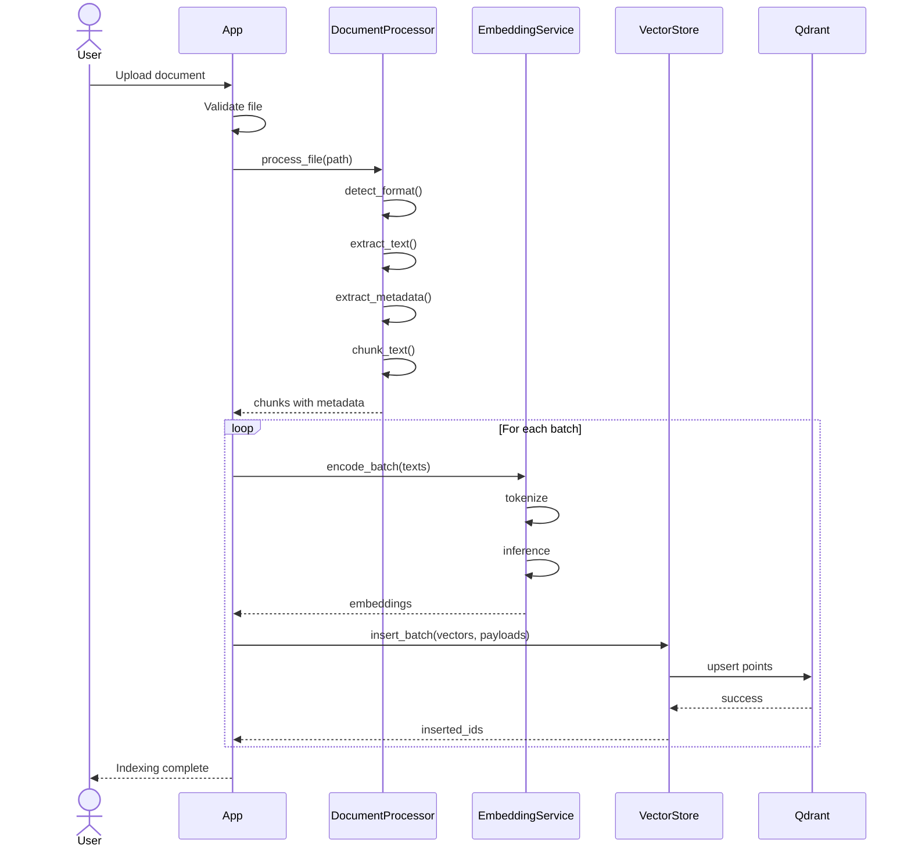
```mermaid
sequenceDiagram
    actor User
    participant App
    participant DocProc as DocumentProcessor
    participant EmbedSvc as EmbeddingService
    participant VectorStore
    participant Qdrant
    
    User->>App: Upload document
    App->>App: Validate file
    App->>DocProc: process_file(path)
    
    DocProc->>DocProc: detect_format()
    DocProc->>DocProc: extract_text()
    DocProc->>DocProc: extract_metadata()
    DocProc->>DocProc: chunk_text()
    DocProc-->>App: chunks with metadata
    
    loop For each batch
        App->>EmbedSvc: encode_batch(texts)
        EmbedSvc->>EmbedSvc: tokenize
        EmbedSvc->>EmbedSvc: inference
        EmbedSvc-->>App: embeddings
        
        App->>VectorStore: insert_batch(vectors, payloads)
        VectorStore->>Qdrant: upsert points
        Qdrant-->>VectorStore: success
        VectorStore-->>App: inserted_ids
    end
    
    App-->>User: Indexing complete
```

### 5.2 Search Query Sequence

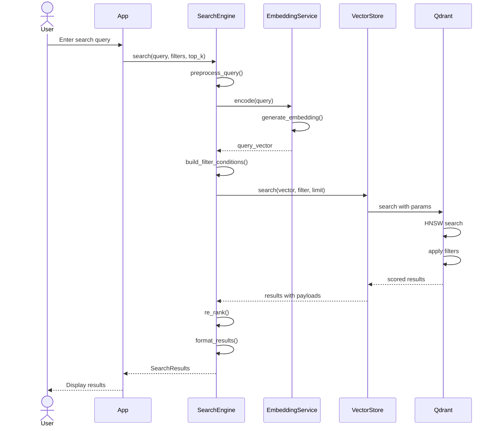
```mermaid
sequenceDiagram
    actor User
    participant App
    participant SearchEngine
    participant EmbedSvc as EmbeddingService
    participant VectorStore
    participant Qdrant
    
    User->>App: Enter search query
    App->>SearchEngine: search(query, filters, top_k)
    
    SearchEngine->>SearchEngine: preprocess_query()
    SearchEngine->>EmbedSvc: encode(query)
    EmbedSvc->>EmbedSvc: generate_embedding()
    EmbedSvc-->>SearchEngine: query_vector
    
    SearchEngine->>SearchEngine: build_filter_conditions()
    SearchEngine->>VectorStore: search(vector, filter, limit)
    
    VectorStore->>Qdrant: search with params
    Qdrant->>Qdrant: HNSW search
    Qdrant->>Qdrant: apply filters
    Qdrant-->>VectorStore: scored results
    
    VectorStore-->>SearchEngine: results with payloads
    SearchEngine->>SearchEngine: re_rank()
    SearchEngine->>SearchEngine: format_results()
    SearchEngine-->>App: SearchResults
    
    App-->>User: Display results
```

### 5.3 Batch Processing Sequence

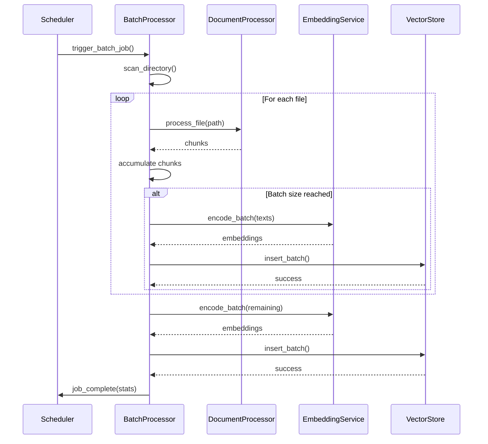
```mermaid
sequenceDiagram
    participant Scheduler
    participant BatchProcessor
    participant DocProc as DocumentProcessor
    participant EmbedSvc as EmbeddingService
    participant VectorStore
    
    Scheduler->>BatchProcessor: trigger_batch_job()
    BatchProcessor->>BatchProcessor: scan_directory()
    
    loop For each file
        BatchProcessor->>DocProc: process_file(path)
        DocProc-->>BatchProcessor: chunks
        
        BatchProcessor->>BatchProcessor: accumulate chunks
        
        alt Batch size reached
            BatchProcessor->>EmbedSvc: encode_batch(texts)
            EmbedSvc-->>BatchProcessor: embeddings
            BatchProcessor->>VectorStore: insert_batch()
            VectorStore-->>BatchProcessor: success
        end
    end
    
    BatchProcessor->>EmbedSvc: encode_batch(remaining)
    EmbedSvc-->>BatchProcessor: embeddings
    BatchProcessor->>VectorStore: insert_batch()
    VectorStore-->>BatchProcessor: success
    
    BatchProcessor->>Scheduler: job_complete(stats)
```

### 5.4 System Initialization Sequence

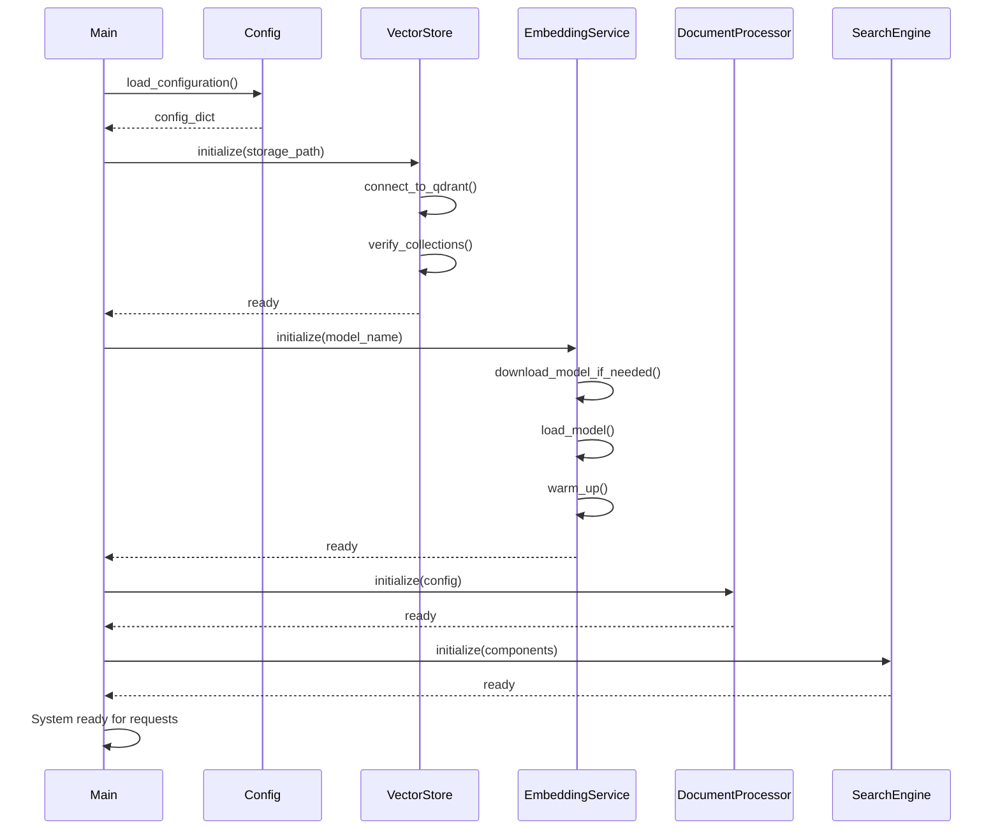
```mermaid
sequenceDiagram
    participant Main
    participant Config
    participant VectorStore
    participant EmbedSvc as EmbeddingService
    participant DocProc as DocumentProcessor
    participant SearchEngine
    
    Main->>Config: load_configuration()
    Config-->>Main: config_dict
    
    Main->>VectorStore: initialize(storage_path)
    VectorStore->>VectorStore: connect_to_qdrant()
    VectorStore->>VectorStore: verify_collections()
    VectorStore-->>Main: ready
    
    Main->>EmbedSvc: initialize(model_name)
    EmbedSvc->>EmbedSvc: download_model_if_needed()
    EmbedSvc->>EmbedSvc: load_model()
    EmbedSvc->>EmbedSvc: warm_up()
    EmbedSvc-->>Main: ready
    
    Main->>DocProc: initialize(config)
    DocProc-->>Main: ready
    
    Main->>SearchEngine: initialize(components)
    SearchEngine-->>Main: ready
    
    Main->>Main: System ready for requests
```

---

## 6. Deployment Architecture

### 6.1 Desktop Deployment

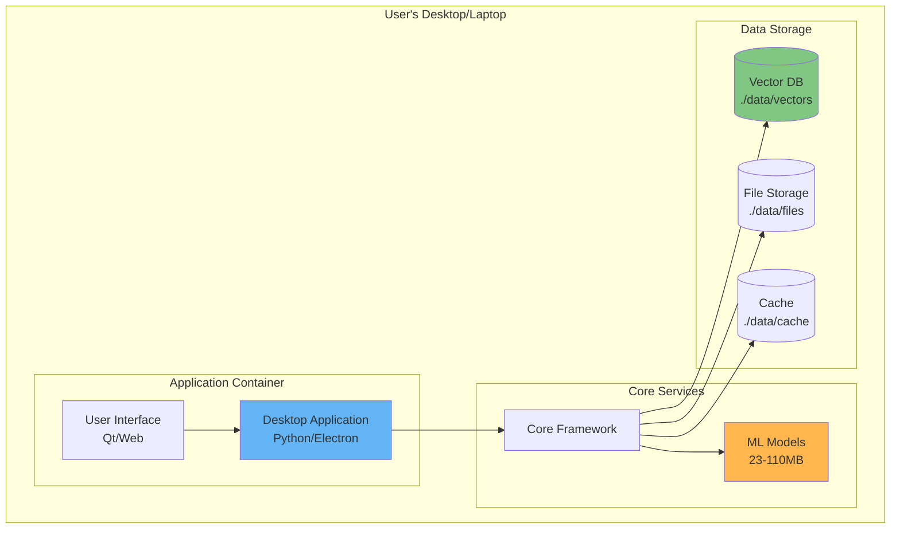
```mermaid
graph TB
    subgraph "User's Desktop/Laptop"
        subgraph "Application Container"
            App[Desktop Application<br/>Python/Electron]
            UI[User Interface<br/>Qt/Web]
        end
        
        subgraph "Core Services"
            Core[Core Framework]
            Models[ML Models<br/>23-110MB]
        end
        
        subgraph "Data Storage"
            VS[(Vector DB<br/>./data/vectors)]
            FS[(File Storage<br/>./data/files)]
            Cache[(Cache<br/>./data/cache)]
        end
        
        UI --> App
        App --> Core
        Core --> Models
        Core --> VS
        Core --> FS
        Core --> Cache
    end
    
    style App fill:#64B5F6
    style VS fill:#81C784
    style Models fill:#FFB74D
```

### 6.2 Mobile Deployment

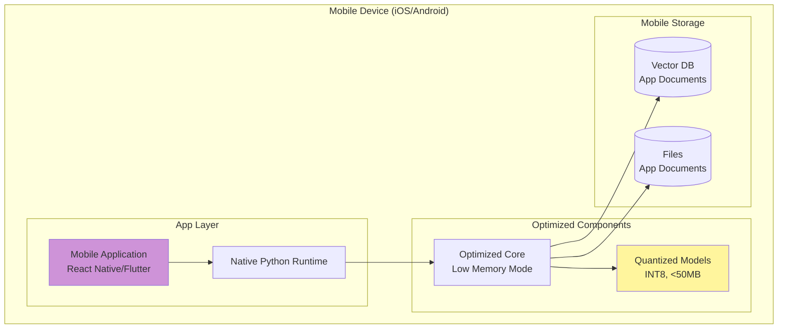
```mermaid
graph TB
    subgraph "Mobile Device (iOS/Android)"
        subgraph "App Layer"
            MobileApp[Mobile Application<br/>React Native/Flutter]
            NativeWrapper[Native Python Runtime]
        end
        
        subgraph "Optimized Components"
            OptCore[Optimized Core<br/>Low Memory Mode]
            QuantModels[Quantized Models<br/>INT8, <50MB]
        end
        
        subgraph "Mobile Storage"
            MobileVS[(Vector DB<br/>App Documents)]
            MobileFS[(Files<br/>App Documents)]
        end
        
        MobileApp --> NativeWrapper
        NativeWrapper --> OptCore
        OptCore --> QuantModels
        OptCore --> MobileVS
        OptCore --> MobileFS
    end
    
    style MobileApp fill:#CE93D8
    style QuantModels fill:#FFF59D
```

### 6.3 Edge Device Deployment

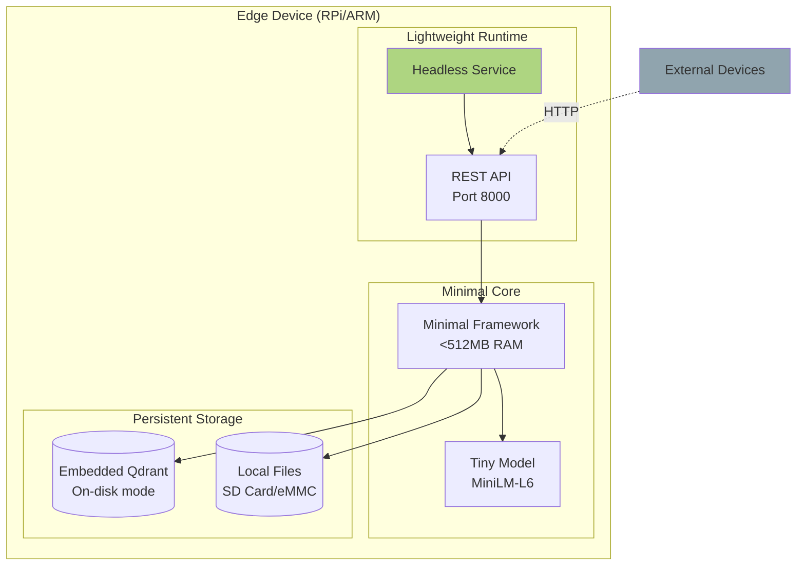
```mermaid
graph TB
    subgraph "Edge Device (RPi/ARM)"
        subgraph "Lightweight Runtime"
            EdgeApp[Headless Service]
            RestAPI[REST API<br/>Port 8000]
        end
        
        subgraph "Minimal Core"
            MinCore[Minimal Framework<br/><512MB RAM]
            TinyModel[Tiny Model<br/>MiniLM-L6]
        end
        
        subgraph "Persistent Storage"
            EdgeVS[(Embedded Qdrant<br/>On-disk mode)]
            EdgeFS[(Local Files<br/>SD Card/eMMC)]
        end
        
        EdgeApp --> RestAPI
        RestAPI --> MinCore
        MinCore --> TinyModel
        MinCore --> EdgeVS
        MinCore --> EdgeFS
    end
    
    External[External Devices] -.HTTP.-> RestAPI
    
    style EdgeApp fill:#AED581
    style External fill:#90A4AE
```

### 6.4 Multi-User Server Deployment

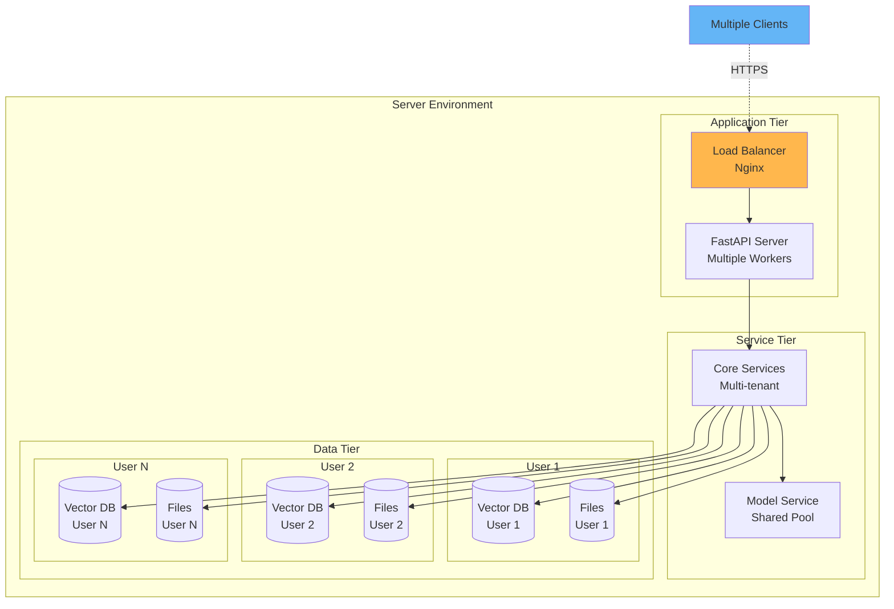
```mermaid
graph TB
    subgraph "Server Environment"
        subgraph "Application Tier"
            WebAPI[FastAPI Server<br/>Multiple Workers]
            LoadBal[Load Balancer<br/>Nginx]
        end
        
        subgraph "Service Tier"
            CoreSvc[Core Services<br/>Multi-tenant]
            ModelSvc[Model Service<br/>Shared Pool]
        end
        
        subgraph "Data Tier"
            subgraph "User 1"
                VS1[(Vector DB<br/>User 1)]
                FS1[(Files<br/>User 1)]
            end
            subgraph "User 2"
                VS2[(Vector DB<br/>User 2)]
                FS2[(Files<br/>User 2)]
            end
            subgraph "User N"
                VSN[(Vector DB<br/>User N)]
                FSN[(Files<br/>User N)]
            end
        end
        
        LoadBal --> WebAPI
        WebAPI --> CoreSvc
        CoreSvc --> ModelSvc
        CoreSvc --> VS1
        CoreSvc --> FS1
        CoreSvc --> VS2
        CoreSvc --> FS2
        CoreSvc --> VSN
        CoreSvc --> FSN
    end
    
    Clients[Multiple Clients] -.HTTPS.-> LoadBal
    
    style Clients fill:#64B5F6
    style LoadBal fill:#FFB74D
```

### 6.5 Air-Gapped Deployment

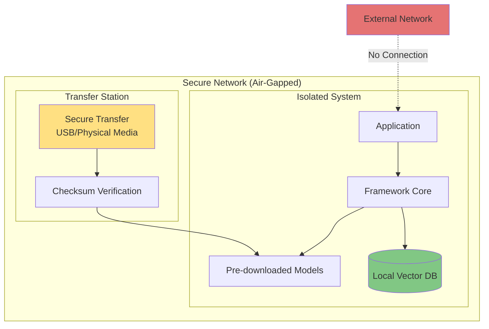
```mermaid
graph TB
    subgraph "Secure Network (Air-Gapped)"
        subgraph "Transfer Station"
            Transfer[Secure Transfer<br/>USB/Physical Media]
            Verify[Checksum Verification]
        end
        
        subgraph "Isolated System"
            App[Application]
            Core[Framework Core]
            PreModels[Pre-downloaded Models]
            LocalDB[(Local Vector DB)]
        end
        
        Transfer --> Verify
        Verify --> PreModels
        App --> Core
        Core --> PreModels
        Core --> LocalDB
    end
    
    External[External Network] -.No Connection.-> App
    
    style Transfer fill:#FFE082
    style External fill:#E57373
    style LocalDB fill:#81C784
```

---

## 7. Database Schema

### 7.1 Qdrant Collection Structure

```mermaid
erDiagram
    COLLECTION ||--o{ POINT : contains
    POINT ||--|| VECTOR : has
    POINT ||--|| PAYLOAD : has
    PAYLOAD ||--o{ METADATA : includes
    
    COLLECTION {
        string name
        int vector_size
        string distance_metric
        object quantization_config
        object hnsw_config
    }
    
    POINT {
        uuid id
        float[] vector
        object payload
        int version
    }
    
    VECTOR {
        float[] values
        int dimensions
    }
    
    PAYLOAD {
        string text
        string source
        string doc_id
        int chunk_id
        datetime created_at
        object custom_metadata
    }
    
    METADATA {
        string key
        any value
    }
```

### 7.2 Document Metadata Schema

```json
{
  "document_id": "uuid-string",
  "filename": "example.pdf",
  "file_type": "pdf",
  "file_size": 1048576,
  "upload_date": "2026-01-10T18:52:00Z",
  "chunks": [
    {
      "chunk_id": 0,
      "text": "Chunk text content...",
      "start_char": 0,
      "end_char": 500,
      "page_number": 1,
      "section": "Introduction",
      "vector_id": "uuid-string"
    }
  ],
  "metadata": {
    "author": "John Doe",
    "title": "Document Title",
    "language": "en",
    "tags": ["tag1", "tag2"],
    "custom_field": "value"
  },
  "processing_info": {
    "chunking_strategy": "sentence",
    "embedding_model": "all-MiniLM-L6-v2",
    "processed_at": "2026-01-10T18:52:30Z"
  }
}
```

### 7.3 Vector Point Payload Structure

```json
{
  "id": "550e8400-e29b-41d4-a716-446655440000",
  "vector": [0.123, -0.456, 0.789, "... 384 dimensions"],
  "payload": {
    "text": "This is the actual text content of the chunk.",
    "document_id": "parent-doc-uuid",
    "chunk_index": 0,
    "source_file": "example.pdf",
    "page_number": 1,
    "section_title": "Introduction",
    "created_at": "2026-01-10T18:52:00Z",
    "metadata": {
      "author": "John Doe",
      "category": "technical",
      "tags": ["ai", "ml", "vector-search"]
    }
  }
}
```

---

## 8. Technology Stack

### 8.1 Technology Overview

```mermaid
graph TB
    subgraph "Frontend/Interface"
        T1[CLI - Click/Typer]
        T2[Web UI - HTML/CSS/JS]
        T3[REST API - FastAPI]
    end
    
    subgraph "Application Layer"
        T4[Python 3.9+]
        T5[Pydantic - Data Validation]
        T6[Async IO]
    end
    
    subgraph "ML/AI Layer"
        T7[Sentence Transformers]
        T8[PyTorch]
        T9[Transformers Library]
        T10[ONNX Runtime Optional]
    end
    
    subgraph "Vector Search"
        T11[Qdrant Client]
        T12[Qdrant Embedded]
        T13[HNSW Index]
    end
    
    subgraph "Document Processing"
        T14[PyPDF2]
        T15[python-docx]
        T16[BeautifulSoup HTML]
        T17[chardet Encoding]
    end
    
    subgraph "Utilities"
        T18[NumPy]
        T19[Pandas Optional]
        T20[Logging]
        T21[ConfigParser]
    end
    
    T1 --> T4
    T2 --> T3
    T3 --> T4
    
    T4 --> T7
    T7 --> T8
    T7 --> T9
    
    T4 --> T11
    T11 --> T12
    T12 --> T13
    
    T4 --> T14
    T4 --> T15
    T4 --> T16
    
    T4 --> T18
    
    style T12 fill:#4CAF50
    style T7 fill:#2196F3
    style T4 fill:#FF9800
```

### 8.2 Dependency Matrix

| Component | Library | Version | Purpose |
|-----------|---------|---------|---------|
| **Core** | Python | 3.9+ | Programming language |
| **Vector DB** | qdrant-client | 1.7.0+ | Vector search engine |
| **Embeddings** | sentence-transformers | 2.3+ | Text embeddings |
| **ML Framework** | torch | 2.0+ | Neural network inference |
| **ML Models** | transformers | 4.36+ | Model architectures |
| **API** | fastapi | 0.108+ | REST API framework |
| **Server** | uvicorn | 0.25+ | ASGI server |
| **PDF** | PyPDF2 | 3.0+ | PDF text extraction |
| **DOCX** | python-docx | 1.1+ | Word document processing |
| **HTML** | beautifulsoup4 | 4.12+ | HTML parsing |
| **Data** | numpy | 1.24+ | Numerical operations |
| **Validation** | pydantic | 2.5+ | Data validation |
| **CLI** | click | 8.1+ | Command-line interface |
| **Testing** | pytest | 7.4+ | Unit testing |
| **Typing** | typing-extensions | 4.9+ | Type hints |

### 8.3 Model Selection Matrix

| Model | Dimensions | Size | Speed | Quality | Use Case |
|-------|----------|------|-------|---------|----------|
| **all-MiniLM-L6-v2** | 384 | 23MB | Fast | Good | Default, mobile, edge |
| **all-mpnet-base-v2** | 768 | 110MB | Medium | Excellent | Desktop, high accuracy |
| **paraphrase-multilingual** | 768 | 470MB | Slow | Excellent | Multi-language support |
| **all-MiniLM-L12-v2** | 384 | 33MB | Medium | Better | Balanced option |
| **distiluse-base-multilingual** | 512 | 135MB | Medium | Good | Multilingual, mid-size |

### 8.4 Performance Configuration Matrix

| Deployment | RAM | Storage | Model | Quantization | Max Docs |
|------------|-----|---------|-------|--------------|----------|
| **Mobile** | <1GB | <2GB | MiniLM-L6 | int8 | 50K |
| **Desktop** | 2-4GB | <10GB | MiniLM-L6/mpnet | int8 | 500K |
| **Server** | 8GB+ | <50GB | mpnet | fp32/int8 | 5M+ |
| **Edge** | <512MB | <1GB | MiniLM-L6 | int8 | 10K |
| **Air-Gapped** | 4GB+ | <20GB | Custom | int8 | 1M |

---

## 9. Performance Benchmarks

### 9.1 Latency Profile

```mermaid
graph LR
    subgraph "Search Latency Breakdown (100K docs)"
        A[Total: 21ms] --> B[Query Embed: 8ms]
        A --> C[Vector Search: 10ms]
        A --> D[Post-process: 3ms]
    end
    
    subgraph "Indexing Throughput"
        E[90 docs/sec] --> F[Embedding: 65%]
        E --> G[Processing: 20%]
        E --> H[Insert: 15%]
    end
    
    style A fill:#81C784
    style E fill:#64B5F6
```

### 9.2 Scalability Chart

```mermaid
graph TB
    subgraph "Documents vs Latency"
        N1["1K docs<br/>12ms"] --> N2["10K docs<br/>15ms"]
        N2 --> N3["100K docs<br/>21ms"]
        N3 --> N4["1M docs<br/>32ms"]
    end
    
    subgraph "Documents vs Memory"
        M1["1K docs<br/>50MB"] --> M2["10K docs<br/>140MB"]
        M2 --> M3["100K docs<br/>425MB"]
        M3 --> M4["1M docs<br/>3.8GB"]
    end
```

---

## 10. Security Architecture

### 10.1 Security Layers

```mermaid
graph TB
    subgraph "Security Layers"
        L1[Application Security<br/>Input Validation, Output Encoding]
        L2[Data Security<br/>Encryption at Rest]
        L3[Access Control<br/>Authentication & Authorization]
        L4[Network Security<br/>Optional: API Keys, Rate Limiting]
        L5[Physical Security<br/>Device-level Protection]
    end
    
    L1 --> L2
    L2 --> L3
    L3 --> L4
    L4 --> L5
    
    style L1 fill:#FFCDD2
    style L2 fill:#F8BBD0
    style L3 fill:#E1BEE7
    style L4 fill:#D1C4E9
    style L5 fill:#C5CAE9
```

### 10.2 Data Flow Security

```mermaid
sequenceDiagram
    participant User
    participant App
    participant Encryption
    participant Storage
    
    User->>App: Upload sensitive doc
    App->>App: Validate & sanitize
    App->>Encryption: Encrypt content
    Encryption->>Encryption: AES-256
    Encryption-->>App: Encrypted data
    App->>Storage: Store encrypted
    Storage-->>App: Success
    
    User->>App: Search query
    App->>Storage: Retrieve encrypted
    Storage-->>App: Encrypted data
    App->>Encryption: Decrypt
    Encryption-->>App: Plain text
    App->>App: Process search
    App-->>User: Results
```

---

## Conclusion

This architecture document provides comprehensive technical diagrams and specifications for the On-Device AI Framework. The modular, layered design ensures scalability, maintainability, and flexibility while maintaining the core benefits of offline operation and data privacy.

**Key Architectural Highlights:**
- **Modular Design**: Clear separation of concerns enables independent development and testing
- **Scalable**: Handles from 1K to 5M+ documents depending on deployment
- **Flexible**: Supports multiple deployment scenarios from mobile to server
- **Secure**: Privacy-first design with encryption and access control
- **Performant**: Sub-100ms search with optimized indexing pipeline

For implementation details, see the project code in the repository.

---

**Document Version:** 1.0  
**Last Updated:** January 10, 2026
